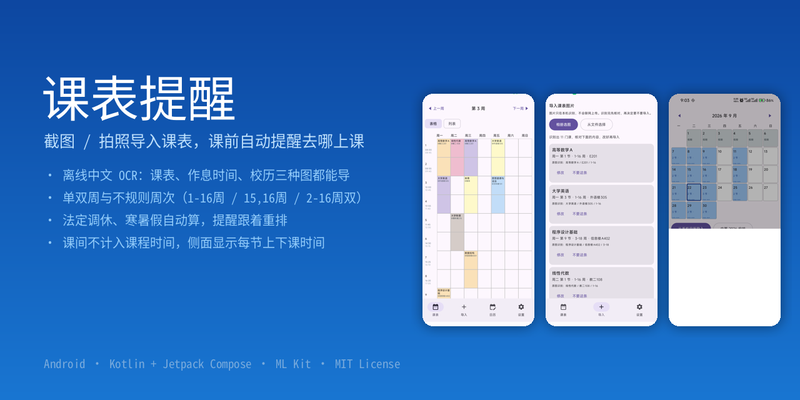
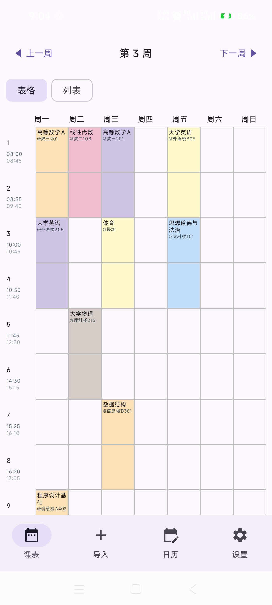
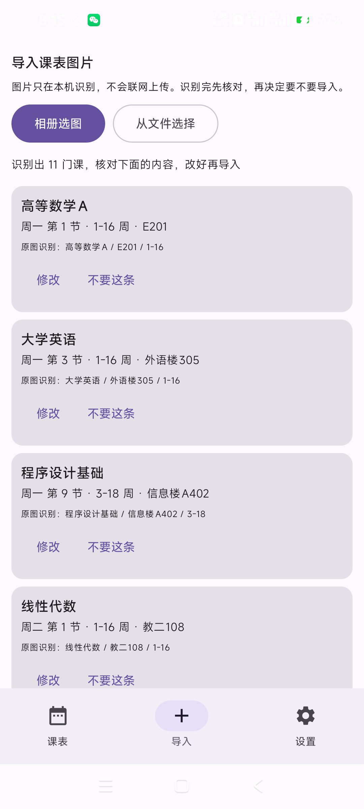
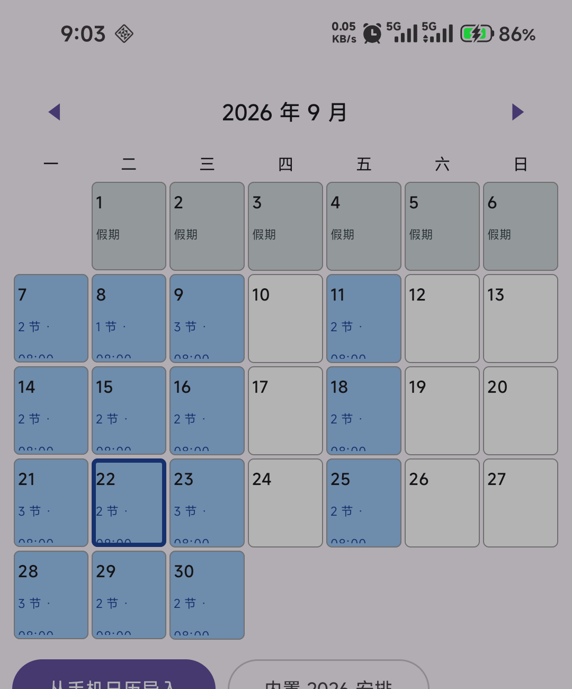

<div align="center">
  
</div>

# 课表提醒

把课表**截图**丢进来，自动识别成课程；每节课前 N 分钟提醒你**几点、去哪上课**。
全程离线，课表只存在手机本地，不联网、不上传。

## 功能

| 功能 | 说明 |
| --- | --- |
| 图片导入 | 「课表 / 作息时间表 / 教学校历」三种图都能识别（ML Kit 离线中文 OCR，不需要 Google 服务） |
| 周次 | 单双周 + 不规则周次：`1-16周`、`15,16周`、`2-16周(双)`、`11-11周`、`13-14周` |
| 课前提醒 | `AlarmManager` 精确闹钟，课前 N 分钟发通知（默认 20 分钟，可逐课设置），通知里带上课地点；强提醒响铃时通知上有「停止响铃」，划掉通知/点开应用也会停 |
| 法定调休 | 放假/调休可手动标；系统日历读不到时（MIUI 很常见）自动套用内置的国务院安排，假期不会再提醒上课 |
| 寒暑假 | 学期区间之外的日期自动按学生假期显示，也不会排提醒 |
| 两种视图 | **列表**（默认，按星期分组逐节列时间）、**表格**（周视图，侧面显示每节上下课时间） |
| 自定义图标 | 选一张自己的图当桌面图标（安卓不允许应用直接换 launcher 图标，这里用自定义图标的快捷方式 / 1×1 小组件实现） |
| 设置二级菜单 | 设置页是一级分组菜单，点进去是具体设置项；主页面与设置子页都支持左右滑动切换 |
| 手动编辑 | 点空格子加课、点课程改课、编辑框里删课；识别结果一律先核对再入库 |

## 截图

| 表格视图 | 识别结果核对 | 教学日历 |
| :---: | :---: | :---: |
|  |  |  |

## 下载安装

**[⬇️ 下载最新 APK](https://github.com/jun-heng-zhao/class-reminder/releases/latest)**（`app-release.apk`，minSdk 26 / Android 8.0+）

装完首次进入按提示给通知权限；小米 / HyperOS 建议再到系统设置里允许**自启动**、省电策略改**无限制**，否则提醒可能不派发。

## 从源码构建

```bash
# 需要 Android SDK（compileSdk 37）与 JDK 17+
export ANDROID_HOME=$HOME/Android/Sdk
./gradlew assembleDebug
adb install -r app/build/outputs/apk/debug/app-debug.apk
```

工具链：AGP 9.4（内置 Kotlin，无需再应用 `kotlin-android` 插件）、Gradle 9.6、compileSdk 37 / minSdk 26 / targetSdk 36。

## 上手四步

1. **设置第一周**：设置页填「第一周的周一」；也可以导一张校历图片让它自己读。
2. **导课表**：导入 → 「课表图片」 → 选图 → 核对识别结果 → 导入。
3. **导作息时间**：导入 → 「作息时间图片」读出每节课几点上下课（默认内置华侨大学教务处公布的 13 节时间表，设置页可逐节改）。
4. **标调休**：日历页标放假/调休；学期区间之外的日期自动显示为寒暑假。

## 实现要点

- **表格还原**（`ocr/GridParser.kt`）：横向课表（表头是 `周一…周日`）和纵向课表（左列是 `一…日`、顶行是 `第X-Y节`）都能认；方向靠"哪一边聚出了至少 3 个星期名"自动判断。
  真实截图里会混进浏览器标签栏、地址栏、状态栏、右侧面板，这些按"表头以上/最右列以外"一律不进网格。
  ML Kit 读不出单笔画的 `一`/`二`/`三` 时，用内容行带把缺的星期补回来。
- **周次**（`data/Model.kt` 的 `Course.weekSpec`）：原始写法整串留着（`15,16`），提醒和课表都按它算，光靠"起止周"表达不了只上第 15、16 周的课。
- **调休**（`data/Model.kt` 的 `DayOverride` + `domain/WeekCalc.effectiveDayOfWeek`）：逐日覆盖"这天按星期几上课"。调休上班日 `swapToDayOfWeek = 0` 表示待安排 —— 这天先不排课也不提醒，等用户在日历页指定（解码时要把 0 原样保住，夹到 1 会变成"上周一的课"而误发提醒）。
- **节假日数据**（`data/BuiltInHolidays.kt` + `data/DeviceCalendar.kt`）：MIUI / HyperOS 不对第三方应用开放「中国法定节假日」，所以优先读系统日历、读不到就自动套用内置数据。2025 / 2026 是国务院完整安排（含调休上班日），更靠后的年份只算得出元旦、春节、清明、劳动节、国庆的法定假日，不需要联网也不靠每年更新数据。
- **提醒**（`remind/ReminderScheduler.kt`）：只排未来 8 天的精确闹钟，每次响铃/开机/改数据都重排一次；不常驻后台也不会漏。学期区间（第 1 周~总周数）之外的日期不排提醒。
- **强提醒响铃**（`remind/AlarmPlayer.kt`）：铃声由全局单例管着，通知上的「停止响铃」、划掉通知、点开应用、以及 1 分钟超时都会调 `stop()` 并释放播放器，不会出现"响了只能杀进程"。
- **存储**（`data/Codec.kt`）：数据量极小（几十条），用纯文本行格式写 `filesDir/schedule.txt`，不引 Room/KSP，逻辑纯 Kotlin 可直接跑 JVM 单测。
- **自定义图标**（`data/IconStore.kt` + `widget/IconWidgetProvider.kt`）：安卓不允许应用在运行时替换自己的 launcher 图标（图标必须是编译期资源），所以退一步做：选好的图存本地，再以「自定义图标的快捷方式 / 1×1 桌面小组件」摆到桌面上，点一下进应用。
- **设置结构**（`ui/SettingsScreen.kt` + `ui/SettingsPages.kt`）：一级是分组菜单，二级页面用 `HorizontalPager` 装着、可左右滑动切换；顶层的课表/导入/日历/设置也是 pager，与底部导航共用同一个状态。

## 目录结构

```
app/src/main/java/com/balance/classreminder/
├── MainActivity.kt              入口
├── data/   Model.kt Codec.kt Store.kt DeviceCalendar.kt BuiltInHolidays.kt IconStore.kt
├── domain/ WeekCalc.kt          周次、上课时间、调休、寒暑假
├── ocr/    OcrModels.kt GridParser.kt PeriodParser.kt CalendarParser.kt TimetableOcr.kt
├── remind/ Notifier.kt AlarmPlayer.kt ReminderScheduler.kt ReminderReceiver.kt StopAlarmReceiver.kt BootReceiver.kt
├── widget/ IconWidgetProvider.kt 自定义图标的 1×1 桌面小组件
└── ui/     AppRoot.kt ScheduleScreen.kt ImportScreen.kt CalendarScreen.kt
            SettingsScreen.kt SettingsPages.kt EditCourseDialog.kt Format.kt
app/src/test/                    单测（含真机 OCR 原文回放）
tools/make_sample_timetable.py   生成示例课表图
docs/SPEC.md                     设计规格
```

## 测试

```bash
./gradlew testDebugUnitTest
```

43 个单测，覆盖周次计算、单双周、不规则周次、调休/放假、寒暑假不排提醒、内置节假日数据、连堂课合并、编解码，以及用**真机 OCR 原文回放**的课表解析回归测试（`app/src/test/resources/ocr_dump_real.txt`）。

## 已知限制

- OCR 对小字号、低对比度的文字（周次、节次那一行）识别率有限，识别错字在核对页改一下即可，逻辑不会错。
- 小米/HyperOS 需要手动允许「自启动」并把省电策略设为「无限制」，否则系统可能不派发提醒（应用内设置页有提示和跳转）。
- 调休上班日到底上哪天的课，各校执行不一致，需要自己指定。
- 法定节假日：优先读系统日历里订阅的「中国法定节假日」；读不到就用内置数据。内置的 2025/2026 是国务院完整安排，其他年份只含可计算的法定假日（元旦 / 春节 / 清明 / 劳动节 / 国庆），端午与中秋请从系统日历导入或手动标。
- **桌面图标**：安卓不允许第三方应用在运行时换自己的 launcher 图标，所以「自定义图标」给的是同效果的替代品——把选好的图做成快捷方式 / 1×1 桌面小组件摆到桌面上（MIUI / HyperOS 会拒给第三方固定请求，需要在「长按桌面 → 添加小部件 → 课表提醒」里手动拖一个）。想换系统里那个图标本身，用 MIUI 桌面自带的「长按图标 → 编辑/更换图标」，或者把上面那个自定义图标摆上去、删掉原图标。

## 许可

[MIT](LICENSE) © 2026 jun-heng-zhao
